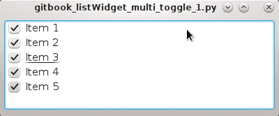

# 同时勾选多个items
框选多个item之后，用空格键可以勾选/去选多个item，效果如下图所示：



方法是reimplement keyPressEvent，只要按键是空格键，就勾选/去选选择了的items，代码如下

```
```python```

from PyQt4 import QtGui, QtCore
from PyQt4.QtCore import Qt, QString
import sys
import os


class ThumbListWidget(QtGui.QListWidget):

    def __init__(self, type, parent=None):
        super(ThumbListWidget, self).__init__(parent)
        self.setIconSize(QtCore.QSize(124, 124))
        self.setSelectionMode(QtGui.QAbstractItemView.ExtendedSelection)
        self.setAcceptDrops(True)
        self.setSelectionRectVisible(True)

    def keyPressEvent(self, event):

        if event.key() == Qt.Key_Space:
            if self.selectedItems():
                new_state = Qt.Unchecked if self.selectedItems()[0].checkState() else Qt.Checked
                for item in self.selectedItems():
                    if item.flags() & Qt.ItemIsUserCheckable:
                        item.setCheckState(new_state)

            self.viewport().update()

        elif event.key() == Qt.Key_Delete:
            for item in self.selectedItems():
                self.takeItem(self.row(item))

    def iterAllItems(self):
        for i in range(self.count()):
            yield self.item(i)


class Dialog(QtGui.QMainWindow):

    def __init__(self):
        super(QtGui.QMainWindow, self).__init__()
        self.listItems = {}

        myQWidget = QtGui.QWidget()
        myBoxLayout = QtGui.QVBoxLayout()
        myQWidget.setLayout(myBoxLayout)
        self.setCentralWidget(myQWidget)

        self.listWidgetA = ThumbListWidget(self)
        for i in range(5):
            QtGui.QListWidgetItem('Item ' + str(i + 1), self.listWidgetA)

        for item in self.listWidgetA.iterAllItems():
            item.setFlags(item.flags() | Qt.ItemIsUserCheckable)
            item.setCheckState(Qt.Checked)

        myBoxLayout.addWidget(self.listWidgetA)
        self.listWidgetA.setAcceptDrops(False)
        self.listWidgetA.viewport().update()

if __name__ == '__main__':
    app = QtGui.QApplication(sys.argv)
    dialog = Dialog()
    dialog.show()
    dialog.resize(400, 140)
    sys.exit(app.exec_())
```
但是还存在一个问题，希望能够在框选了多个item之后，通过单击任意一个item的checkbox，也能达到勾选/去选所有item的效果，此时可以给list widget添加如下几个method：
```python
    def mouseReleaseEvent(self, event):
        item = self.selectedCheckStateItem(event.pos())
        if item:
            selectedItems = self.selectedItems()
            new_state = Qt.Unchecked if item.checkState() == Qt.Checked else Qt.Checked
            self.setSelectedCheckStates(new_state, item)
            # QtGui.QApplication.processEvents()
            self.viewport().update()

        QtGui.QListWidget.mouseReleaseEvent(self, event)
        if item:
            for sel_item in selectedItems:
                sel_item.setSelected(True)

    def setSelectedCheckStates(self, state, click_item):
        for item in self.selectedItems():
            if item is not click_item:
                item.setCheckState(state)

    def selectedCheckStateItem(self, pos):
        item = self.itemAt(pos)
        if item:
            opt = QtGui.QStyleOptionButton()
            opt.rect = self.visualItemRect(item)
            rect = self.style().subElementRect(QtGui.QStyle.SE_ViewItemCheckIndicator, opt)
            if item in self.selectedItems() and rect.contains(pos):
                return item
        return None
        ```
其原理是当鼠标按键释放时，通过在`selectedCheckStateItem`中判断释放位置是否刚好在某个item的左侧的checkbox上，如果是，则返回此item，否则返回None。

如果确实鼠标按键在某个item左侧的checkbox上释放了，那就拿到他现在的勾选状态，然后相应的勾选/去选当前所有选中的items。

**Note:**

- 解决问题的关键点是
```python
opt = QtGui.QStyleOptionButton()
opt.rect = self.visualItemRect(item)
rect = self.style().subElementRect(QtGui.QStyle.SE_ViewItemCheckIndicator, opt)
            ```
此3行代码得到的是某个item的左侧的checkbox所占据的rect。

