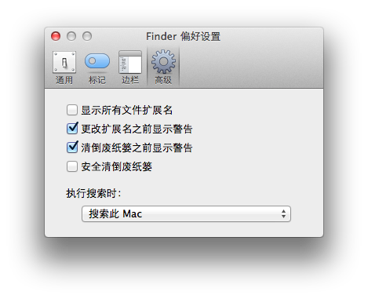
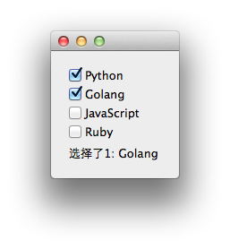

# 动态创建一系列组件并绑定信号和槽

如上图所示的需求，需要创建4个QCheckBox，一种做法是直接Designer中设计，这种做法适合知道选项的情况。还有种情况是这些选项是通过配置文件读出来的，或者是数据库中取出来，或者其他情况得到的，这时候就需要动态创建了。

解决思路是循环一个列表，创建对象，插入布局即可。这里稍微增加一些复杂性，对所创建的QCheckBox对象进行信号和槽的绑定，并处理信号，这时候我们可以通过`sender()`方法来获得是哪个对象发出的信号。

其他的控件类似，这里就用QCheckBox做例子了。

下面是完整代码(PyQt4/Python2.7)：

    # -*- coding: utf-8 -*-
    from PyQt4 import QtGui, QtCore

    class Widget(QtGui.QWidget):
        def __init__(self, parent=None):
            QtGui.QWidget.__init__(self, parent)

            layout = QtGui.QVBoxLayout()

            items = [(0, 'Python'), (1, 'Golang'), (2, 'JavaScript'), (3, 'Ruby')]
            for id_, text in items:
                checkBox = QtGui.QCheckBox(text, self)
                checkBox.id_ = id_
                checkBox.stateChanged.connect(self.checkLanguage)
                layout.addWidget(checkBox)

            self.lMessage = QtGui.QLabel(self)
            layout.addWidget(self.lMessage)

            self.setLayout(layout)

        def checkLanguage(self, state):
            checkBox = self.sender()    # 获取发射信号的对象

            if state == QtCore.Qt.Unchecked:
                self.lMessage.setText(u'取消选择了{0}: {1}'.format(checkBox.id_, checkBox.text()))
            elif state == QtCore.Qt.Checked:
                self.lMessage.setText(u'选择了{0}: {1}'.format(checkBox.id_, checkBox.text()))

    if __name__ == '__main__':
        import sys

        app = QtGui.QApplication(sys.argv)
        widget = Widget()
        widget.show()
        sys.exit(app.exec_())

效果截图：

